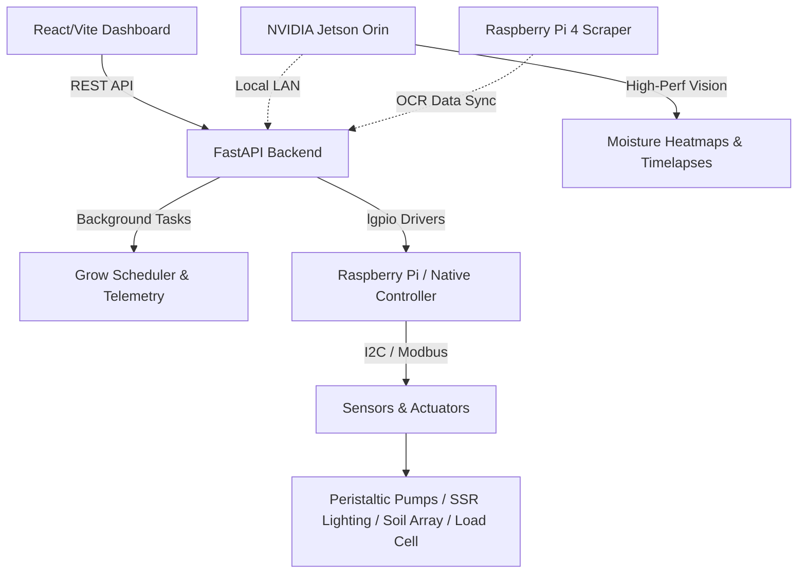

# 🌿 AMiGA: Automated Modular Irrigation & Growth Assistant


> **A research-grade platform for Precision Agriculture and Automated Plant Cultivation.**

AMiGA (Automated Modular Irrigation & Growth Assistant) is an open-source, NASA-affiliated prototype developed at the **Autonomy Research Center for STEAHM (ARCS)**. It represents the cutting edge of **Controlled Environment Agriculture (CEA)**, bridging the gap between academic research and sustainable, hyper-efficient food production pipelines. 

By unifying modular hardware with a robust full-stack software environment, AMiGA allows researchers, agronomists, and developers to closely monitor, simulate, and automate plant growth conditions natively.

---

## ✨ Core Capabilities & Key Features

Our platform goes beyond standard automated watering setups. It's a cohesive, multi-node architecture designed to handle rigorous data collection and real-world farm integration:

- **🛡️ Autonomous Control Loop:** Closed-loop feedback mechanisms that perfectly balance irrigation, diurnal light scheduling, and complex nutrient delivery without human intervention.
- **📊 True Soil Analytics:** Continuous 7-in-1 soil chemistry tracking (incorporating NPK levels, pH, Electrical Conductivity, Temperature, and Moisture indexing).
- **🌬️ Atmospheric Sensing:** High-precision environmental tracking using I2C protocols (SCD41 for CO2/Temp/Humidity and TSL2561 for precise Luminosity).
- **⚖️ Precision Telemetry:** Real-time load-cell tracking to measure evapotranspiration rates, nutrient uptake weight, and final harvest biomass.
- **🧠 Edge Computer Vision:** Jetson Orin-powered hardware-accelerated image pipeline handling IR moisture heatmaps and ultra-high-resolution timelapses.
- **💻 Dev-First Simulation:** Full hardware simulation layer (`start_simulate.sh`) that allows developers to write code, test algorithms, and build the UI on Windows/Mac without needing access to a physical Raspberry Pi or Jetson Orin.

---

## 📐 System Architecture

AMiGA is designed with scalability and high modularity in mind. 

### Overarching Topology


### Module Breakdown

1. **Backend (Python / FastAPI)**  
   Residing in `/backend`, the core logic operates as a high-performance REST API. It handles hardware abstraction via specialized driver classes, manages persistent local state (`api/`, `data/`), and orchestrates the `grow_scheduler`. It asynchronously processes telemetry to dedicated persistent CSV layers for research reproducibility.

2. **Frontend (React / Vite)**  
   Residing in `/frontend`, the dashboard is a responsive web application built with **React, Vite, and Tailwind CSS**. It provides a single-pane-of-glass view for researchers, allowing instant manual overrides, rule configuration for moisture thresholds, and live data visualization of soil health and system metrics.

3. **Edge Computing Integrations**  
   To offload high-compute tasks, the AMiGA architecture spans out to edge devices:
   - **Jetson Orin (`/orin/scripts`)**: Captures heavy analytical visual data such as thermal/IR moisture mapping and processes long-term timelapse generation via GStreamer offloading.
   - **Pi4 Telemetry Scraper (`/pi4`)**: Serves as a dedicated node to interactively execute OCR and scrape data from closed-ecosystem apps (e.g., proprietary equipment like Vivosun smart environments).

---

## 🏗️ Hardware Composition

The physical manifestation of AMiGA leverages premium agricultural components controlled by robust drivers:

*   **💧 Irrigation:** Peristaltic pumps driven precisely by TMC2209 stepper drivers to dose micro-amounts of nutrients.
*   **☀️ Lighting:** High-intensity photosynthetic active radiation (PAR) grow lights, controlled safely via solid-state relays (SSR).
*   **🌡️ Atmospherics:** SCD41 sensors (CO2/Temp/Hum) and TSL2561 (Luminosity).
*   **🌱 Soil Intelligence:** Hybrid setup utilizing an Analog Moisture Array alongside a 7-in-1 Modbus NPK/pH/EC soil intelligence sensor.
*   **⚖️ Measurement:** Dedicated load cells configured for continuous weight sampling to correlate irrigation input with plant mass growth.

---

## 🚀 Quick Setup & Installation

AMiGA is engineered for low friction. It provides auto-configured deployment scripts across all major operating systems.

### 1. Automatic Dependency Installation

Depending on your host machine, navigate to the `scripts` directory and run the setup script to instantly pull requirements, set up virtual environments (`.venv`), and initialize local data stores:

- **Windows:** Run `.\scripts\install_dependencies.bat`
- **Linux/Pi:** Run `./scripts/install_dependencies.sh`
- **macOS:** Run `./scripts/install_dependencies_mac.sh`

### 2. Booting the Control Stack

| Operating Mode    | Environment             | Command                                | Description                               |
| :---------------- | :---------------------- | :------------------------------------- | :---------------------------------------- |
| **Simulation**    | Windows                 | `.\scripts\start_simulate.bat`         | Boots UI and mock backend hardware layers.|
| **Simulation**    | Linux / macOS           | `./scripts/start_simulate.sh`          | Boots UI and mock backend hardware layers.|
| **Native Prod**   | Raspberry Pi / Hardware | `./scripts/start.sh` (supports `--host`)| Runs actual GPIO drivers & real hardware  |
| **Scale Service** | Raspberry Pi            | `./scripts/start_scale_hw.sh`          | Standalone precision weight management    |

---

## 📂 Repository Structure Navigation

```text
AMiGA/
├── backend/            # FastAPI core, hardware classes, async schedulers, and unit tests
├── frontend/           # React + Vite web dashboard application
├── orin/               # NVIDIA Jetson Orin specialized computer vision and thermal scripts
├── pi4/                # Telemetry scraping and OCR integration scripts
├── docs/               # Detailed technical documentation (system, hardware, recipes)
├── scripts/            # Deployment, startup, and telemetry shell/batch scripts
├── data/               # Persistent local storage (e.g., CSV telemetry logs, SQLite)
├── kratky/             # Auxiliary legacy modes (hydroponic routines)
└── legacy/             # Deprecated experimental concepts & tests
```

---

## 📖 Deep-Dive Documentation

For researchers, contributors, and operators looking to understand the inner workings, explore our extended technical documents:

- **[`docs/system_overview.md`](docs/system_overview.md)** - Comprehensive architectural and software structural breakdown.
- **[`docs/hardware_integration.md`](docs/hardware_integration.md)** - Specifics on hardware wiring, sensor calibration, and component datasheets.
- **[`docs/hardware/`](docs/hardware/)** - Dedicated documentation directory for individual subsystems (e.g., Orin vision, sensors, lights, pumps, load cells, atmospherics).
- **[`docs/recipe_manager.md`](docs/recipe_manager.md)** - Guide for plant nutrition routing, germination staging, and crop cycles (e.g., Microgreens).

---

## 🌎 About ARCS FOODI

AMiGA is developed actively under the **FOODI** initiative — _Facilitating Overcoming Obstacles to the Development and Integration of Modern Technologies for Controlled Environment Agriculture_. 

This core mission is focused on securing humanity's food independence through advanced STEM research, sustainable agricultural architectures, and data-driven cultivation.

👉 [Visit the ARCS FOODI Website](https://arcs.center/facilitating-overcoming-obstacles-to-development-and-integration-foodi-of-modern-technologies-for-controlled-environment-agriculture-cea/)
