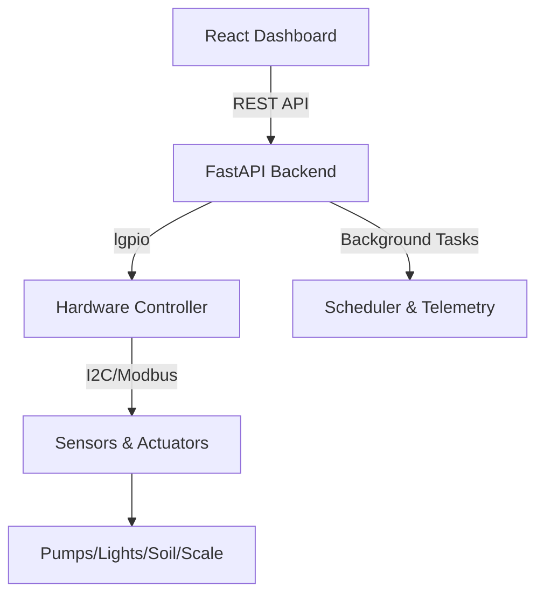

# 🌿 AMiGA: Automated Modular Irrigation & Growth Assistant

**A research-grade platform for Precision Agriculture and Automated Plant Cultivation.**

AMiGA (Automated Modular Irrigation & Growth Assistant) is an open-source, NASA-affiliated prototype developed at the **Autonomy Research Center for STEAHM (ARCS)**. It represents the cutting edge of **Controlled Environment Agriculture (CEA)**, bridging the gap between academic research and sustainable food production.

---

## ✨ Key Features

- **🛡️ Autonomous Control:** Closed-loop feedback for irrigation, light scheduling, and nutrient delivery.
- **📊 Soil Analytics:** Continuous 7-in-1 soil chemistry tracking (NPK, pH, EC, Temp, Moisture).
- **🌬️ Atmospheric Sensing:** High-precision CO2, temperature, and humidity monitoring via SCD41.
- **⚖️ Precision Telemetry:** Real-time load-cell tracking for nutrient and biomass weight.
- **🛠️ Modular Architecture:** Easily extensible Python-FastAPI backend with a modular React-Vite dashboard.
- **💻 Dev-First Simulation:** Full hardware simulation layer for cross-platform development without a Raspberry Pi.

---

## 📐 System Architecture

---

## 🏗️ Quick Setup

### 🚀 Automatic Installation

AMiGA provides one-click scripts for all platforms.

- **Windows:** Run `.\install_dependencies.bat`
- **Linux/Pi:** Run `./install_dependencies.sh`
- **macOS:** See manual setup in [[system_overview]].

### 🏃‍♂️ Running the System

| Mode            | Windows                | Linux / macOS / Pi    |
| :-------------- | :--------------------- | :-------------------- |
| **Simulation**  | `.\start_simulate.bat` | `./start_simulate.sh` |
| **Native (Pi)** | —                      | `./start.sh`          |

---

## 📖 Learn More

Explore the detailed technical documentation in the `docs/` folder:

- **[[system_overview]]** - Full architectural and software breakdown.
- **[[hardware_integration]]** - Detailed wiring and component guides.

---

## 🌎 About FOODI

AMiGA is developed under the **FOODI** initiative — _Facilitating Overcoming Obstacles to the Development and Integration of Modern Technologies for Controlled Environment Agriculture_.

👉 [Visit the ARCS FOODI Website](https://arcs.center/facilitating-overcoming-obstacles-to-development-and-integration-foodi-of-modern-technologies-for-controlled-environment-agriculture-cea/)
