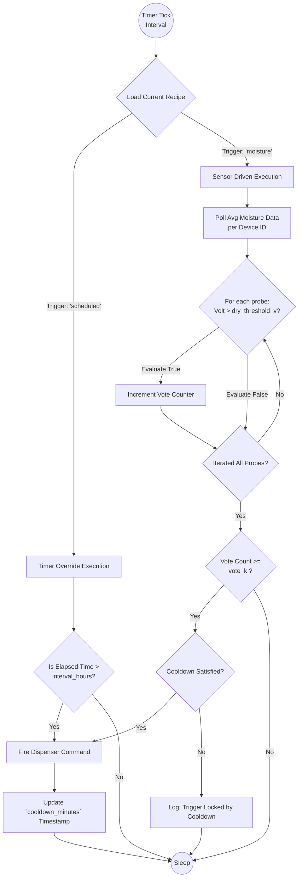

# Automation Loop & Scheduler Logic

This flowchart documents the logical cycle undertaken by the background task `grow_scheduler` to determine whether fluid dispense automation limits are met.

## Execution Flow

## Parameter Definitions

1.  **Timer Tick**: The scheduler awakens periodically to iterate this loop asynchronously alongside regular web API responses.
2.  **`scheduled` vs `moisture` Modes**: A recipe completely governs the control path. If forced to `scheduled`, it bypasses soil conditions to guarantee feeding on an absolute interval.
3.  **`vote_k` Consensus System**: Since the system operates Arrays of 4 individual nodes per tray, an individual node might prematurely dry (due to local heat pockets or poor contact). `vote_k` strictly mandates that a *minimum number of separate probes* must agree that the tray is completely "dry" before actuating a pump. 
4.  **Hardware Safe (Cooldown)**: A critical safety measure. Even if `vote_k` agrees to dry boundaries, this timer explicitly overrides all operations, blocking the pump for a designated span (usually 60 mins) to allow water to fully absorb into the soil metric before assessing requirements again, preventing runaway flood events.
