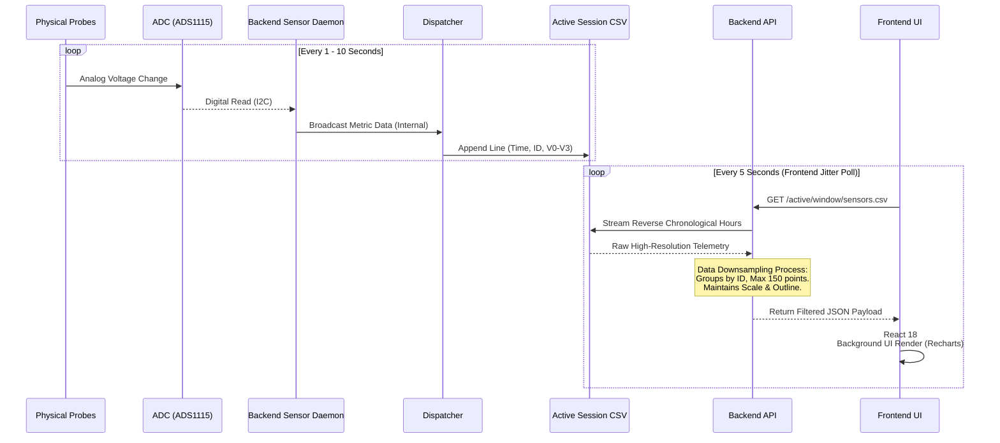

# Hardware Data Flow & Telemetry

This diagram outlines the detailed lifecycle of a sensor reading—from the moment physical soil voltage is captured to when it's rendered as an interactive chart on the frontend.

## Data Pipelining Sequence

## Description of Stages

1.  **Analog Conversion (Hardware Limit)**: The physical probes measure resistance. The ADC board converts this to a digital voltage signal over I2C to the Raspberry Pi.
2.  **Continuous Polling (Local Logging)**: The robust local polling daemon continually attempts reading. If a read succeeds, it offloads to the asynchronous `EventBus` to ensure no IO blocking. 
3.  **Persistence**: The `EventBus` commits data to long-term `CSV` files immediately, providing maximum accuracy data-logging for science audits.
4.  **Optimized Retrieval (API Layer)**: Because the UI cannot handle translating potentially 100,000+ coordinates, the FastAPI backend processes the CSV when the UI poles for data. It calculates chronological bounding boxes and downsamples values using smart bucket strategies retaining only major feature points.
5.  **Non-Blocking UI Rendering**: React processes charting paths in background transitions causing zero lock-up or stutter on the main application interface despite rich visualization.
