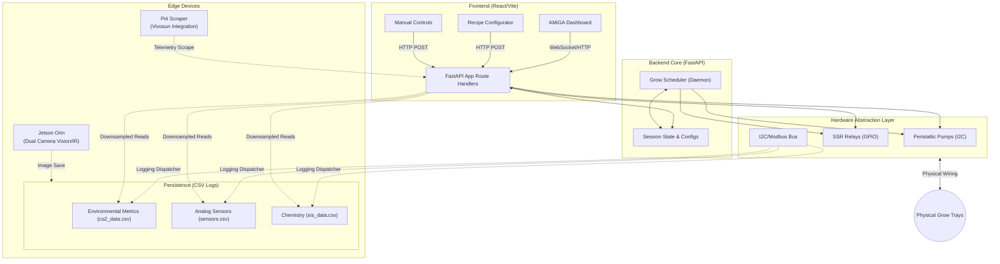

# High-Level System Architecture

This diagram illustrates the macro-level architecture of the AMiGA system, showing how the separate components interact across hardware and software boundaries.

## System Components

## Component Breakdown

1.  **Web Tier (Frontend)**: Responsible for visualization. The frontend actively queries the `API_Gateway` to render dynamic charts.
2.  **Execution Tier (Backend)**: The core brain running on a local Raspberry Pi/PC. Handles all business logic, routing, and automation (via the `Grow Scheduler`).
3.  **Hardware Gateway**: Contains specific Python driver code used to serialize signals over standard hardware interfaces.
4.  **Data Tier**: Represents the persistent local CSV files. We decouple high-frequency sensor writes from API reads utilizing a pub-sub data dispatcher layout.
5.  **Edge Nodes**: Auxiliary devices acting on the periphery of the main system, contributing to or fetching from the primary platform.
