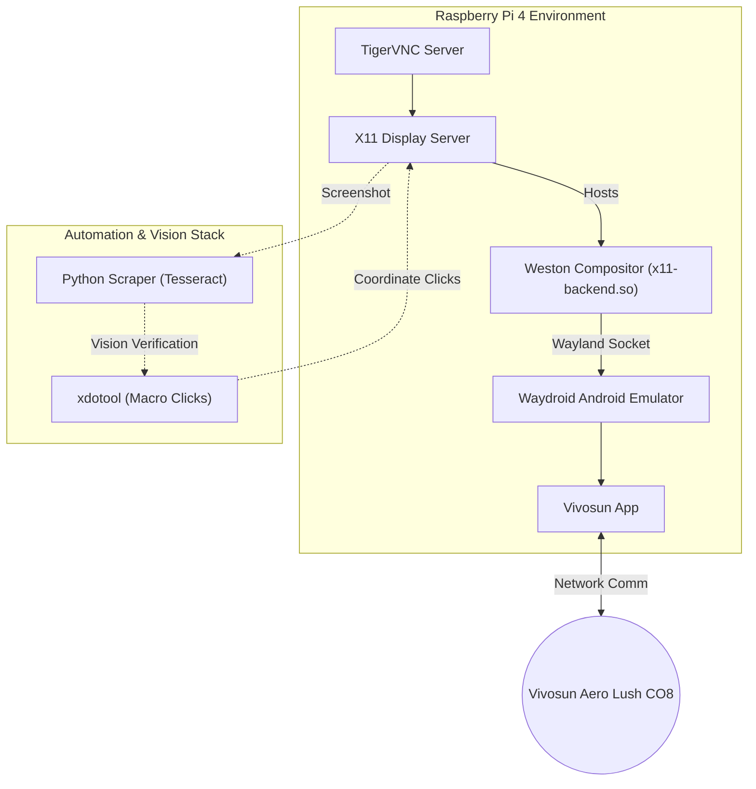

# Commercial Integration via UI Automation (Vivosun)

A major innovation of the AMiGA architecture is its ability to bypass closed-ecosystem API restrictions on commercial hardware. Using a combination of Android emulation, cross-platform compositors, Optical Character Recognition (OCR), and coordinate-plane macros, the Raspberry Pi can fully automate the **Vivosun Aero Lush** Air Conditioning network. 

## Architectural Challenge: X11 vs. Wayland

To support remote "offsite" development, the Raspberry Pi must run **X11** in order to host remote-desktop sessions via **TigerVNC**. 

However, to run Android applications natively on Linux without extreme overhead, **Waydroid** is required, which natively mandates a **Wayland** environment. 

### The Solution: The Weston Bridge

To maintain architecture without sacrificing remote debugging capabilities, `start_vivosun.sh` acts as an environmental bridge:

1. A **Weston Compositor** is spawned explicitly using the `x11-backend.so` driver.
2. The Wayland socket is exposed dynamically.
3. Waydroid boots Android UI *inside* the Weston window natively rendered on the X11 desktop.

## Setup & Execution Flow

To cleanly and securely inject this into a production pipeline, the execution relies on two distinct phases:

### Phase 1: Smartphone Initialization (Setup Only)
The initial setup protocol (e.g. bluetooth handshake and network registry) is impossible to do from a headless Pi in a metal box. 
1. The hardware is initially paired to the team's project account using a standard smartphone over Bluetooth.
2. The AC binds to our local network under that account profile.
3. The Waydroid emulator logs into the identical project account. Due to the cloud handshake, the emulator instantly recognizes the paired Aero Lush AC unit over the local network without needing Bluetooth.

### Phase 2: Macro Vision Verification (Continuous)
Because UI layouts are absolute within the constrained Weston window, `xdotool` is used to execute coordinate-plane functions (e.g. clicking specifically at X/Y pixels to toggle fans and AC).

To guarantee this commercial setup is robust enough for academic research publication, the macros are supervised by **OCR Vision**:
1. `start_vivosun.sh` teleports the Weston window containing the Android application to a mathematically exact anchor point (`1210x75`).
2. The `vivosun_scraper.py` continuously takes screenshots, acting as the system's "vision". 
3. The OCR validates on-screen states. By reading the text, the system *verifies its actual location within the app* (e.g. confirming it's actually looking at the AC Dashboard and hasn't crashed to the home screen). 
4. The macro is only cleared to trigger X/Y clicks when the Vision system confirms the Android UI is accurately displaying the target landing zone.
